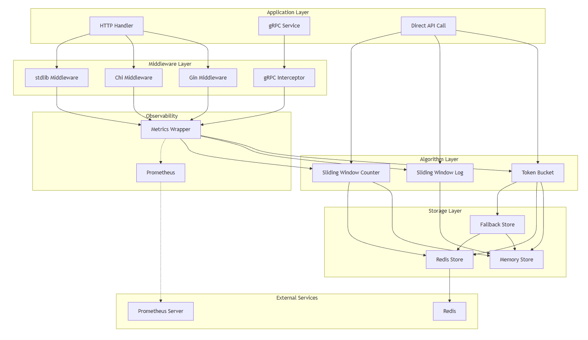
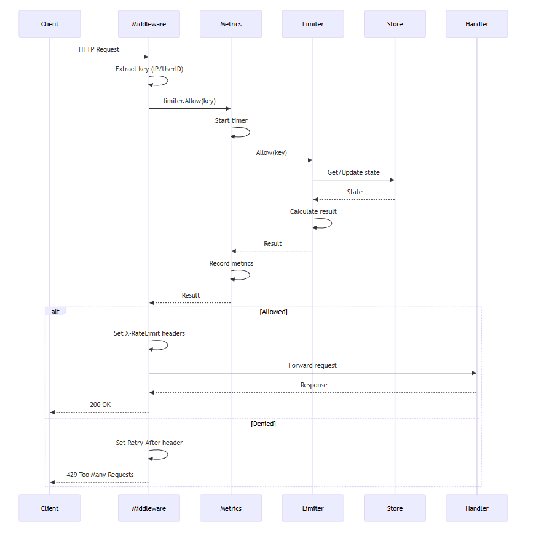
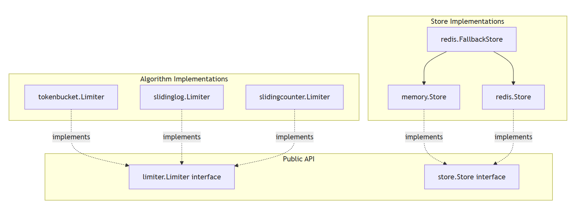

# Архитектура

## Обзор

RateLimiter разработан с четким разделением задач:

- **Алгоритмы** реализуют логику ограничения скорости
- **Хранилища** обрабатывают сохранение состояния  
- **Промежуточное ПО** интегрируется с веб-платформами
- **Метрики** обеспечивают наблюдаемость

## Архитектурная схема



## Поток запросов



## Схема компонентов



# Ключевые дизайнерские решения

## 1. Interface-based Design
```Go

type Limiter interface {
    Allow(key string) Result
    AllowN(key string, n int64) Result
}
```
Все алгоритмы реализуют этот интерфейс, что делает их взаимозаменяемыми.

## 2. Atomic Redis Operations
В операциях Redis используются скрипты Lua для обеспечения атомарности:

```Lua

-- Token bucket in single atomic operation
local tokens = redis.call('GET', key)
if tokens >= requested then
    redis.call('DECRBY', key, requested)
    return {1, tokens - requested}  -- allowed
end
return {0, tokens}  -- denied
```
## 3. Zero-Allocation Fast Path
Алгоритмы, используемые в оперативной памяти, оптимизированы для нулевого выделения ресурсов:

```text
BenchmarkTokenBucket    138.9 ns/op    0 B/op    0 allocs/op
```

## 4. Graceful Degradation
FallbackStore автоматически переключается на работу в памяти, когда Redis недоступен, обеспечивая непрерывную работу приложения.

## 5. Prometheus Integration
Оболочка Metrics добавляет минимальные накладные расходы (~300 нс), обеспечивая при этом полную наблюдаемость:

- Количество запросов (разрешено/отклонено).
- Гистограммы задержки
- Датчики активных ключей
---

